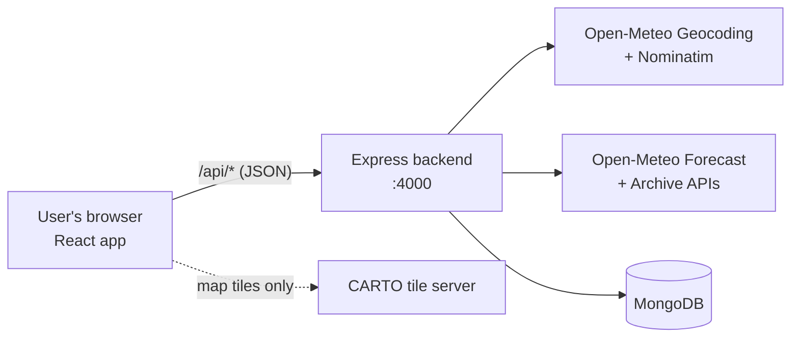
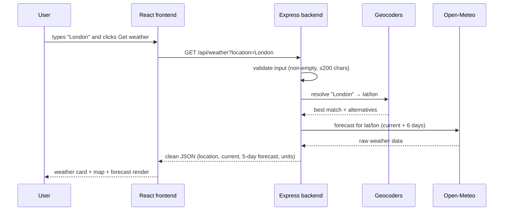
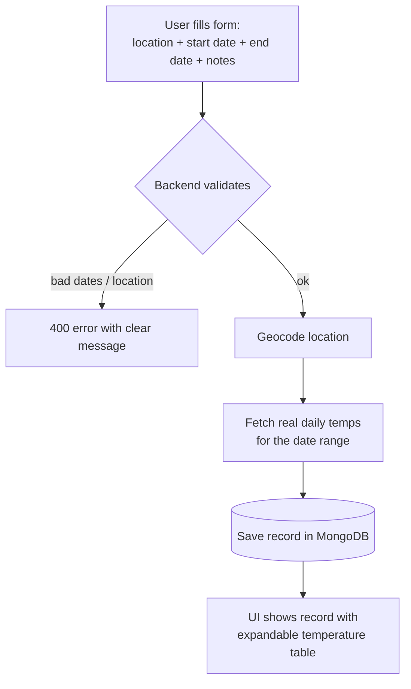
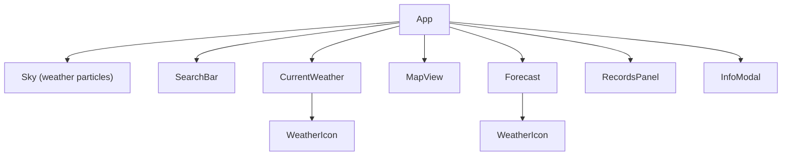

# Atmos — Weather App Documentation

> A full-stack weather application built by **Ehab Hesham** for the PM Accelerator
> AI Engineer Intern tech assessment. This document explains the whole project in
> simple terms, with diagrams, so anyone (or any tool) can present it clearly.

---

## 1. What is this project?

Atmos is a weather website. You type **any kind of location** — a city name, a zip
code, a landmark like "Eiffel Tower", or raw GPS coordinates — and it shows you:

- **Current weather**: temperature, "feels like", humidity, wind, pressure,
  precipitation, sunrise/sunset, and UV index.
- **A 5-day forecast** with daily highs/lows, rain chance, and practical
  "traveler tips" (e.g. *"Rain likely. Pack an umbrella."*).
- **An interactive map** pinned to the searched location.
- A **"Use my location"** button that uses the browser's GPS.
- **Celsius/Fahrenheit** toggle.

On top of that, it has a small database feature ("Saved weather requests"):

- **Save** a location + date range → the server fetches the *real* temperatures
  for those dates and stores everything.
- **View, edit, and delete** saved records (full CRUD).
- **Export** the whole database as **JSON, CSV, XML, or Markdown** with one click.

Everything runs on **free public APIs — no API keys are needed at all.**

---

## 2. The big picture (architecture)


The project has two halves that talk over HTTP:

| Part | Technology | Port | Job |
|---|---|---|---|
| **Frontend** | React 18 + Vite, Leaflet for maps | 5173 | Everything the user sees and clicks |
| **Backend** | Node.js + Express, Mongoose | 4000 | Validation, talking to weather APIs, database |
| **Database** | MongoDB (embedded via `mongodb-memory-server`, or any `MONGODB_URI`) | — | Stores saved weather records |

The frontend never calls the weather APIs directly — it always goes through the
backend. The Vite dev server proxies every `/api/*` request to `localhost:4000`,
so the browser code just calls relative URLs.



### External services used (all free, keyless)

| Service | Used for |
|---|---|
| Open-Meteo **Geocoding API** | Turning city names / zip codes into coordinates |
| **Nominatim** (OpenStreetMap) | Landmarks, addresses, fuzzy queries, and reverse geocoding of raw coordinates |
| Open-Meteo **Forecast API** | Current weather + forecasts (also covers the recent past ~3 months) |
| Open-Meteo **Archive API** | Historical temperatures back to **1940** |
| **CARTO** dark map tiles + **Leaflet** | The map view (loaded directly by the browser) |

---

## 3. What happens when you search




Smart details worth mentioning:

- **Input flexibility**: if the input looks like `"51.5, -0.1"` it's treated as
  coordinates and reverse-geocoded into a place name. Otherwise the Open-Meteo
  geocoder is tried first (best for cities/zips), and **Nominatim is the
  fallback** (best for landmarks like "Statue of Liberty").
- **"Not what you meant?"**: the backend returns alternative matches, and the UI
  shows them as clickable chips (e.g. London UK vs. London, Ontario).
- **The 5-day forecast skips today** — the cards always show the *next* five days.
- **Errors are friendly**: bad input → 400, unknown place → 404, weather API
  down → 502, each with a human-readable message shown as a dismissible banner.

---

## 4. The records feature (CRUD + export)

The "Saved weather requests" panel is the database part of the assessment.



**Validation rules** (enforced server-side in `validate.js`):

- Dates must be real calendar dates in `YYYY-MM-DD` format, start ≤ end.
- Range is capped at **31 days**.
- No dates before **1940-01-01** (archive limit) or more than **14 days** in the
  future (forecast limit).

**Where the temperatures come from**: past days use the Open-Meteo **Archive
API**; recent/future days use the **Forecast API**. A range spanning both is
fetched from each and merged, de-duplicated by date.

**Editing** a record re-validates and **re-fetches** the temperatures; the
coordinates and temperature data are system-managed and can't be hand-edited.

### API reference

| Method & path | What it does |
|---|---|
| `GET /api/health` | Liveness check |
| `GET /api/weather?location=...` | Current weather + 5-day forecast for any location input |
| `POST /api/records` | Create a record (location + date range + optional notes) |
| `GET /api/records` | List all records, newest first (max 200) |
| `GET /api/records/:id` | One record |
| `PUT /api/records/:id` | Update location/dates/notes (re-validates, re-fetches temps) |
| `DELETE /api/records/:id` | Delete a record |
| `GET /api/records/export?format=json\|csv\|xml\|markdown` | Download the whole database as a file |

### Data model (MongoDB `Record`)

```text
rawLocationInput  what the user typed           e.g. "london"
resolvedName      what the geocoder found       e.g. "London, England, United Kingdom"
latitude/longitude, country, timezone
startDate/endDate YYYY-MM-DD strings
temperatures[]    { date, tempMax, tempMin, tempMean } per day, in °C
notes             free text (max 500 chars)
createdAt/updatedAt automatic timestamps
```

---

## 5. Code map (where everything lives)

```text
Weather_app/
├── frontend/
│   ├── index.html               page shell (loads Leaflet CSS)
│   └── src/
│       ├── main.jsx             React entry point
│       ├── App.jsx              top-level state: search, errors, unit, theme
│       ├── api.js               tiny fetch wrapper for all backend calls
│       ├── weatherCodes.js      WMO weather code → label / icon / theme / tips
│       ├── hooks.js             useCountUp (animated number)
│       ├── icons.jsx            inline SVG line-icon set
│       ├── styles.css           the whole design system (flat dark UI)
│       └── components/
│           ├── SearchBar.jsx        input + "My location" button
│           ├── CurrentWeather.jsx   big temperature card + stats grid
│           ├── Forecast.jsx         5 day cards + traveler tips
│           ├── MapView.jsx          Leaflet map with custom pin
│           ├── RecordsPanel.jsx     CRUD form, list, export links
│           ├── Sky.jsx              weather particles (rain/snow/stars)
│           ├── WeatherIcon.jsx      animated condition glyphs
│           └── InfoModal.jsx        "About PM Accelerator" dialog
└── backend/
    └── src/
        ├── server.js            Express setup, routes, startup
        ├── db.js                MongoDB connection (embedded fallback)
        ├── models/Record.js     Mongoose schema
        ├── routes/
        │   ├── weather.js       GET /api/weather
        │   └── records.js       full CRUD + export endpoints
        ├── services/
        │   ├── geocode.js       location → coordinates (2 geocoders)
        │   └── weather.js       Open-Meteo fetching + merging
        └── utils/
            ├── validate.js      location + date-range rules
            ├── errors.js        ApiError + error middleware
            └── exporters.js     JSON / CSV / XML / Markdown writers
```

### Frontend component tree



`App.jsx` owns the important state: the current weather response, loading/error
flags, the °C/°F unit, and the **theme**. Everything else receives props.

---

## 6. The design system (after the "de-AI" restyle)

The UI is a **flat dark theme** with one signature feature: the **accent color
reacts to the weather**. The WMO weather code from the API maps to a theme
(`clear-day`, `clear-night`, `cloudy`, `fog`, `rain`, `snow`, `storm`), which
sets a CSS variable (`--accent`) — amber for clear days, ice blue for rain,
pale blue for snow, and so on. A light particle layer (rain streaks, snowflakes,
or stars) matches the live conditions and is fully disabled for users with
`prefers-reduced-motion`.

**Restyle (June 2026):** the original design had a heavy "AI-generated" look that
was deliberately removed. Specifically:

| Removed | Replaced with |
|---|---|
| Two giant glowing gradient orbs drifting behind the page | Plain dark canvas |
| Glassy gradient card backgrounds | Flat solid panels with hairline borders |
| Floating hero icon with a large drop-shadow glow | Static icon |
| Lift-and-glow hover effects on every card/button/chip | Simple border/color changes |
| Full-screen lightning "glow flash" overlay in storms | (removed) |
| Backdrop blur + oversized shadows on the modal | Plain dim + modest shadow |
| Gradient temperature-range bars | Solid accent color |
| Slide-up entrance choreography | Quick simple fade |
| Space Grotesk Google Font | System font stack (also: one less network request) |

What was intentionally **kept**: the weather-reactive accent color, the subtle
condition particles, the animated weather glyphs, the count-up temperature
number, and skeleton loading shimmer — these are product features, not styling
noise.

---

## 7. How to run it

Two terminals:

```bash
# Terminal 1 — backend (port 4000)
cd backend
npm install
npm run dev

# Terminal 2 — frontend (port 5173)
cd frontend
npm install
npm run dev
```

Open <http://localhost:5173>.

**Database setup: none required.** If `MONGODB_URI` is not set (see
`backend/.env.example`), the backend starts an **embedded MongoDB**
(`mongodb-memory-server`) that persists its data on disk in
`backend/.mongodb-data/`, so records survive restarts. Set `MONGODB_URI` to use
Atlas or a local MongoDB instead.

> **Troubleshooting:** if the backend fails on startup with a
> `MongoMemoryServer ... fassert() failure` error, the embedded database's data
> folder was corrupted by an unclean shutdown. Stop the backend, delete the
> `backend/.mongodb-data/` folder, and start again (you lose saved records, but
> the folder is recreated automatically).

---

## 8. Talking points (for a quick demo or presentation)

1. **Zero-setup full stack** — clone, `npm install`, run. No API keys, no
   database install (embedded MongoDB with on-disk persistence).
2. **Flexible location input** — city, zip, landmark, or raw coordinates, with a
   two-geocoder fallback strategy and "did you mean?" alternatives.
3. **Real CRUD with real data** — saved records store *actual* temperatures for
   the chosen date range, merged from two different Open-Meteo APIs (archive for
   the past, forecast for the future).
4. **Robust validation and error handling** — every rule lives server-side, and
   every failure returns a clear, human-readable message.
5. **Four export formats** — JSON, CSV (one row per day), XML, and Markdown,
   streamed as file downloads.
6. **Thoughtful UI details** — weather-reactive accent color, condition
   particles, accessibility (focus rings, `aria` labels, reduced-motion
   support), and a fully responsive layout.
