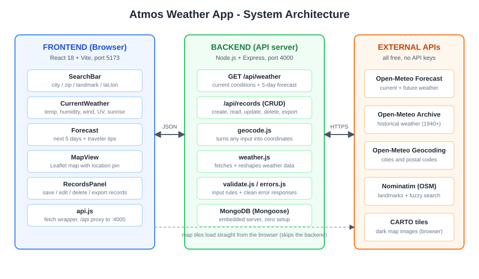
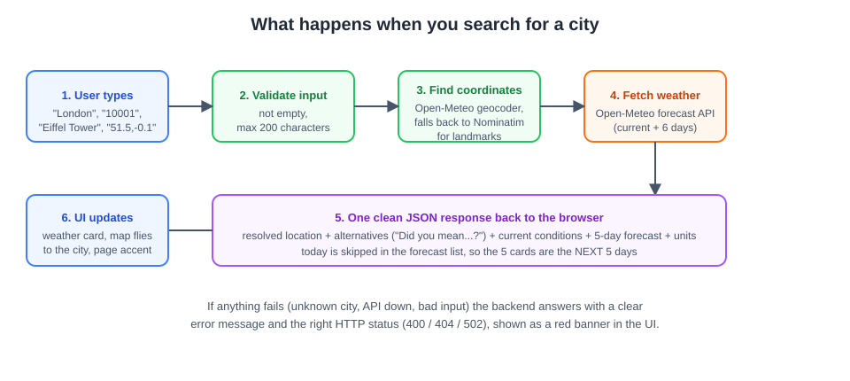

# Atmos: Full Stack Weather App

**Built by Ehab Hesham** for the PM Accelerator AI Engineer Intern technical assessment.

**Assessments completed: BOTH Tech Assessment #1 (Frontend) AND #2 (Backend), the Full Stack track.**

| Layer | Stack |
|---|---|
| Frontend | React 18 + Vite (JavaScript), Leaflet maps, hand-built CSS design system (mobile-first responsive) |
| Backend | Node.js + Express (REST API) |
| Database | MongoDB (Mongoose). Zero setup: auto-starts an embedded MongoDB with a persistent on-disk data directory if no `MONGODB_URI` is provided |
| Weather data | [Open-Meteo](https://open-meteo.com) forecast + archive APIs, **no API key required** |
| Geocoding | Open-Meteo Geocoding (cities, zip/postal codes) + Nominatim/OpenStreetMap (landmarks, addresses, fuzzy match, reverse geocoding) |
| Map tiles | CARTO dark basemap over OpenStreetMap data |

## How to Run

Prerequisites: **Node.js 18+** (tested on Node 20). No API keys, no database install needed.

```bash
# Terminal 1: backend (API on http://localhost:4000)
cd backend
npm install
npm start

# Terminal 2: frontend (UI on http://localhost:5173)
cd frontend
npm install
npm run dev
```

Open http://localhost:5173. The first backend start downloads an embedded MongoDB binary (one time, about a minute). To use your own MongoDB or Atlas instead, copy `backend/.env.example` to `backend/.env` and set `MONGODB_URI`.

> **Troubleshooting**: if the backend fails to start with a `MongoMemoryServer ... fassert() failure` error, the embedded database folder was corrupted by an unclean shutdown. Delete `backend/.mongodb-data/` and start the backend again (the folder is recreated automatically).

## Architecture



How a search flows through the system:



A full plain-language walkthrough (with more diagrams and demo talking points) is in [PROJECT_DOCUMENTATION.md](PROJECT_DOCUMENTATION.md).

## Design

The UI is a custom design system, not a component library. It is a flat dark theme that stays out of the way of the data:

- **Weather-reactive accent color**: the page accent shifts with the live conditions (clear day, clear night, cloud, fog, rain, snow, storm).
- **Condition particles**: a light particle layer behind the app renders falling rain streaks, drifting snow, twinkling stars, or sliding haze to match the weather.
- **Animated vector weather glyphs**: every condition icon is a hand-drawn SVG with CSS animation (rotating sun rays, drifting clouds, falling drops and flakes, flashing bolts, sliding fog). No emoji, no icon font, no image assets.
- **Restrained motion**: count-up temperature transitions, skeleton shimmer while loading, a sliding segmented C/F control, and smooth expand for record details. All motion is disabled under `prefers-reduced-motion`.
- **Typography**: the system font stack (no webfont request) with a light, oversized temperature numeral and uppercase letter-spaced labels.
- A relative **temperature range bar** on each forecast day shows where that day sits within the week's span.

## Tech Assessment #1: Frontend

- **Flexible location input**: one smart search box accepts a **city/town, zip/postal code, landmark (for example "Eiffel Tower"), or GPS coordinates ("40.7,-74")**. Coordinates are detected by pattern; everything else is geocoded with fuzzy matching, and alternative matches are offered as one-click chips ("Not what you meant?").
- **Current location**: the "My location" button uses the browser Geolocation API, then reverse-geocodes the coordinates to a place name.
- **Clear current weather**: temperature, feels-like, condition, humidity, wind, pressure, precipitation, sunrise/sunset, UV index with risk label, the location's **local time** and timezone, and a C/F toggle (wind switches km/h to mph with it).
- **1.1 Five-day forecast**: responsive card grid with animated icons, highs/lows, rain chance, and the relative range bar.
- **1.2 Error handling**: graceful messages for location not found (with suggestions), API/network failures, geolocation permission denied, and invalid input. Errors appear in dismissable alert banners, never a blank screen.
- **Thinking like a traveler** (the "not obvious" extras): local time at the destination, **trip tips** derived from the forecast (pack an umbrella, very high UV, freezing roads, storm and flight-delay warnings, extreme heat), and a map so you can see exactly which "London" you got.

### Responsive design techniques (web-first)
- **Mobile-first CSS** with `min-width` breakpoints at 640/820/920 px.
- **Fluid grids**: `repeat(auto-fit, minmax(...))` for the forecast and stat strips, so they reflow at any width without extra breakpoints.
- **Fluid type and spacing** with `clamp()`.
- Flexbox with wrapping for the header, search, and record rows; the weather + map panel collapses from two columns to one on small screens.
- Verified at 375 px (phone), 768 px (tablet), and 1280 px (desktop).

## Tech Assessment #2: Backend

REST API. All responses are JSON with a consistent `{ "error": "..." }` envelope and proper status codes (400 validation, 404 not found, 502 upstream API failure).

| Method | Endpoint | Purpose |
|---|---|---|
| GET | `/api/health` | Health check |
| GET | `/api/weather?location=...` | Resolve location, return current weather + 5-day forecast |
| POST | `/api/records` | **CREATE**: location + date range, fetch real temperatures, persist |
| GET | `/api/records` | **READ** all stored records (everyone's) |
| GET | `/api/records/:id` | **READ** one record |
| PUT | `/api/records/:id` | **UPDATE** location/date range/notes (re-validated, temperatures re-fetched) |
| DELETE | `/api/records/:id` | **DELETE** a record |
| GET | `/api/records/export?format=json\|csv\|xml\|markdown` | **2.3 Export** |

### 2.1 CRUD details
- **CREATE** validates everything server-side:
  - Date range: real `YYYY-MM-DD` calendar dates, start on or before end, max 31 days, not before 1940 (archive limit), not beyond about 14 days ahead (forecast limit).
  - Location: must resolve via geocoding (fuzzy match allowed); coordinates are range-checked. Unresolvable locations are rejected with a helpful 404.
  - Temperatures for the range come from Open-Meteo: the **archive API** for past dates and the **forecast API** for recent and future dates, merged when a range spans both, then stored with the record.
- **READ** returns all records, newest first, including each day's max/min/mean temperatures.
- **UPDATE** allows editing the location, date range, and notes, with the same validations and an automatic re-fetch of temperatures. Resolved coordinates and the temperature data are system-managed and cannot be hand-edited, which keeps records coherent.
- **DELETE** removes any record by id.

### 2.2 API integration (stand-apart)
- **Map data**: interactive **Leaflet** map on a CARTO dark basemap with a custom vector marker for every searched location.
- **Multiple APIs managed**: Open-Meteo forecast, Open-Meteo archive, Open-Meteo geocoding, and Nominatim (search + reverse), each with timeouts and upstream-failure handling.

### 2.3 Data export
One click in the UI (or `GET /api/records/export?format=...`) downloads the whole database as **JSON, CSV, XML, or Markdown**.

## Error handling examples
- `GET /api/weather?location=Xyzzyqwertyville123` returns `404 {"error":"Location not found: ... Try a city name, zip/postal code, landmark, or \"lat,lon\" coordinates."}`
- `POST /api/records` with `startDate > endDate` returns `400 {"error":"startDate must be on or before endDate"}`
- If a weather or geocoding service is unreachable, the API returns `502` with a friendly retry message; the UI surfaces all of these in an alert banner.

## Project structure

```
backend/
  src/server.js            Express app + middleware
  src/db.js                Mongo connection (URI or embedded fallback)
  src/models/Record.js     Mongoose schema
  src/routes/weather.js    GET current weather + forecast
  src/routes/records.js    CRUD + export endpoints
  src/services/geocode.js  Location resolution (coords / Open-Meteo / Nominatim)
  src/services/weather.js  Current, 5-day forecast, date-range temperatures
  src/utils/validate.js    Date-range and location input validation
  src/utils/exporters.js   JSON / CSV / XML / Markdown exporters
  src/utils/errors.js      ApiError + error middleware
frontend/
  src/App.jsx              Shell, theming, state
  src/api.js               API client (via Vite proxy)
  src/hooks.js             Count-up animation hook
  src/icons.jsx            Hand-drawn line icon set
  src/weatherCodes.js      WMO code mapping, themes, traveler tips
  src/components/          SearchBar, CurrentWeather, Forecast, MapView, Sky,
                           WeatherIcon, RecordsPanel (CRUD UI), InfoModal
  src/styles.css           Design system: tokens, themes, motion
```

The `package.json` files in `backend/` and `frontend/` are the requirements files listing every dependency.

## About PM Accelerator
The Product Manager Accelerator Program supports PM professionals through every stage of their careers, from students looking for entry-level jobs to directors growing into leadership roles, via hands-on AI learning programs, real-world product practice, and a global mentor community. See the [Product Manager Accelerator LinkedIn page](https://www.linkedin.com/school/pmaccelerator/). This description is also shown in-app via the "About PM Accelerator" button.
# atmos-weather-app

